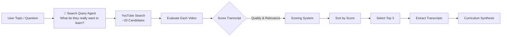
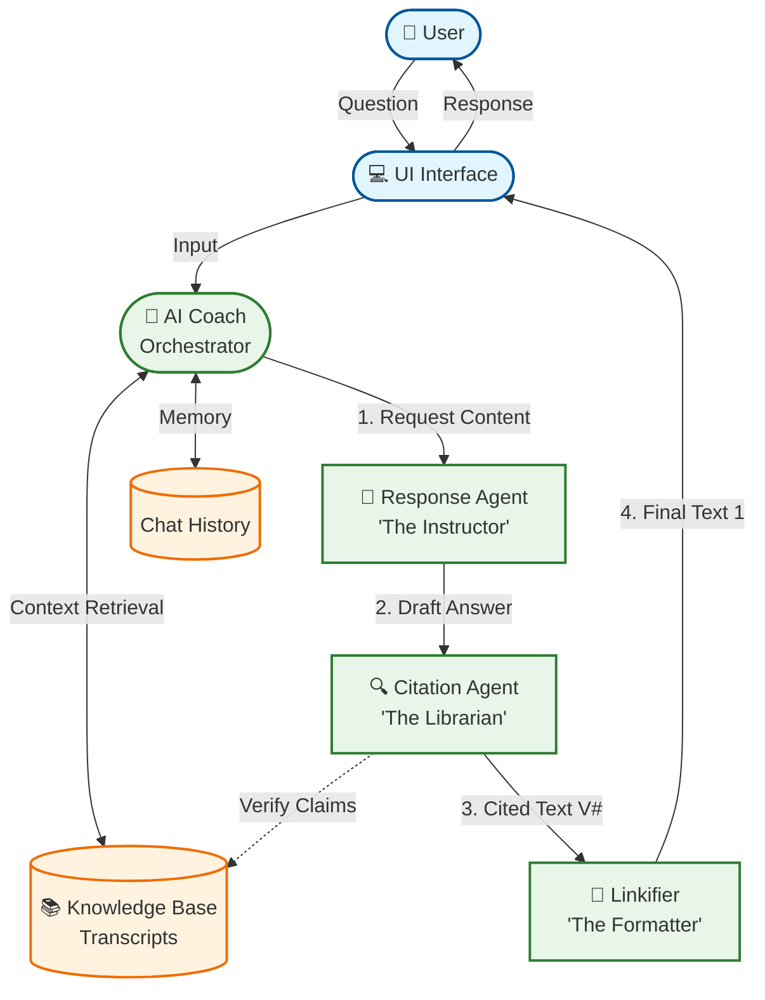

# AI Instruction Manual Generator 🎓

An intelligent system that converts unstructured YouTube tutorials into structured, verifiable, and interactive instruction manuals.

> **Explore sample generated outputs**: [Sample Manuals (Gamma, Figma, NotebookLM)](sample_manuals/)

## 🚀 Key Features
*   **10-Step Chronological Guides**: Automatically synthesizes "from scratch" tutorials for beginners.
*   **Interactive AI Coach**: A chat interface that answers questions about the guide.
*   **Academic-Style Citations**: Every claim is backed by a verifiable source with a timestamped link (e.g., `[1]`, `[2]`).
*   **Multi-Agent Architecture**: Uses specialized agents for drafting content and grounding it in reality.

---

## 🏗️ System Architecture & Dataflow

The system operates in a linear pipeline to generate the manual, followed by a cyclic loop for the interactive coaching session.

### Video Selection & Search Agent Pipeline



### 1. Data Ingestion (Map Phase)
*   **Input**: User Topic (e.g., "Gamma AI", "hey can you teach me Claude Cowork?").
*   **Search Query Agent**: A small Gemini-powered agent rewrites the raw question into a focused YouTube tutorial search (e.g., `Claude Cowork tutorial for beginners`).
*   **Search**: Use the agent query to identify ~20 candidate "long-form" tutorials on YouTube (excluding Shorts/promos).
*   **Evaluation**: Score each candidate based on:
    *   Transcript quality (length, vocabulary diversity)
    *   Topic relevance (keyword frequency)
    *   Content quality (fewer low-content indicators)
    *   Video popularity (search position)
*   **Selection**: Select top 3 highest-scoring videos for best coverage.
*   **Extraction**: Download valid transcripts (VTT) and clean them into timestamped chunks.

### 2. Curriculum Synthesis (Reduce Phase)
*   **Milestone Extraction**: An LLM agent extracts key "atomic concepts" from each video.
*   **Synthesis Agent**: Cross-references milestones to create a unified 10-step path.
*   **Citation Injection**: Identifying which video (`V1`, `V2`) supports which step.

### 3. Interactive Coaching (The "AI Coach")
When the user asks a question, a **Multi-Agent System** generates the response:



*   **Response Agent**: "Here is how you do X..." (Focuses on pedagogy).
*   **Citation Agent**: "Here is how you do X [V1 - 02:30]..." (Focuses on truth).
*   **UI Linkifier**: Converts `[V1 - 02:30]` -> `[1]` and adds the link to the sidebar.

---

## 🤖 Agent Design

We utilize a **Separation of Concerns** principle to prevent hallucinations:

1.  **The Instructor (Response Agent)**
    *   *Goal*: Be helpful, encourage the user, and explain concepts simply.
    *   *Constraint*: Has access to transcripts but is told NOT to worry about specific timestamps to avoid breaking flow.
2.  **The Librarian (Citation Agent)**
    *   *Goal*: Prove every claim.
    *   *Constraint*: Cannot add new advice. Can only insert `[V# - MM:SS]` tags where the text matches the source truth.
3.  **The Referee (Synthesis Agent)**
    *   *Goal*: Ensure the 10-step guide is chronological and logical.
    *   *Constraint*: Must reject non-beginner content (e.g., advanced API usage) if it breaks the "Zero to One" flow.

---

## ✅ Addressing Task Requirements

| Requirement | Implementation |
| :--- | :--- |
| **Complete Beginner Focus** | The `Synthesis Agent` is strictly prompted to create "Zero to Hero" paths, verified by "beginner" persona checks. |
| **Chronological Order** | The system enforces a strict 1-10 step sequence. The `AICoach` will not advance to Step 2 until the user is ready. |
| **YouTube Source** | We use `yt-dlp` to fetch real-time data, ensuring the manual is "latest" and captures evolving features (unlike static training data). |
| **Verification** | **Solved via Citations.** Every instruction is linked to a video timestamp. If the link doesn't match the text, the user can instantly verify it (Hallucination Proofing). |
| **Tech Stack** | Python, LangChain, Google Gemini 3.0 Flash Preview, Gradio (Web UI). |

---

## 🛠️ How to Run

1.  **Install Dependencies**:
    ```bash
    pip install -r requirements.txt
    ```
2.  **Set Environment**:
    Create a `.env` file with your keys:
    ```env
    GOOGLE_API_KEY=your_gemini_key
    YOUTUBE_API_KEY=your_youtube_key
    ```
3.  **Launch App**:
    ```bash
    python app.py
    ```

---

> **Note**: Portions of this README and the underlying codebase were generated with the assistance of Large Language Models.
